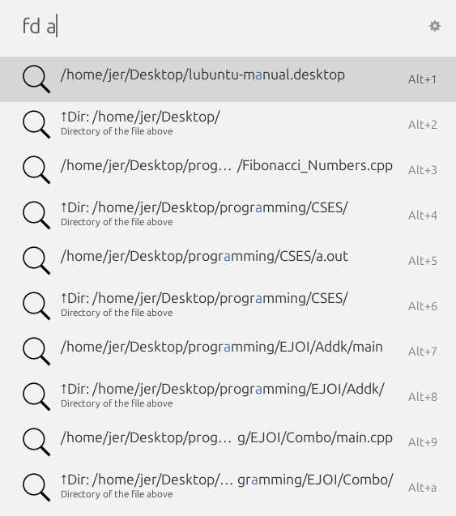
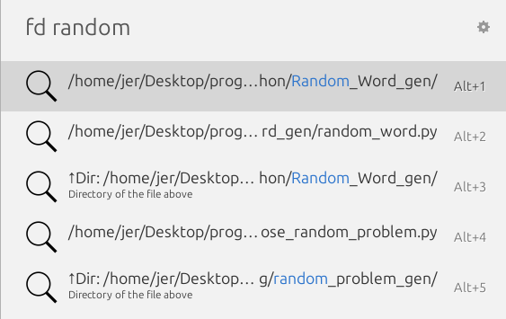
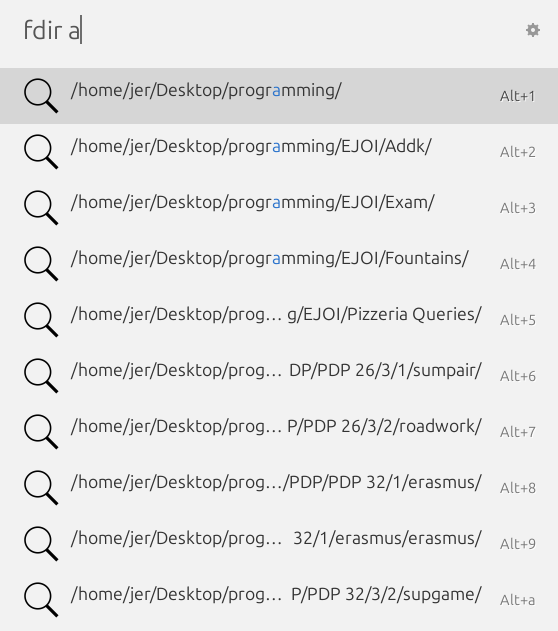
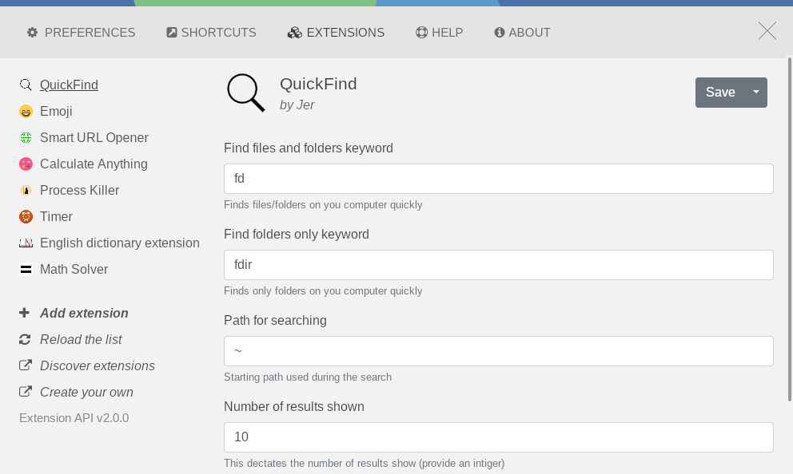

# 🔍 QuickFind for Ulauncher

**QuickFind** is a blazing fast Ulauncher extension that helps you **quickly find files, folders, and more** on your computer — all from your keyboard.

> "Don't search. **QuickFind.**"

---

## Features

- Find files and folders instantly using fd
- Supports custom search directories
- Lightweight and fast
- Smart fuzzy matching
- Designed for Linux based on fd

---

## Preview

---

##  Installation
There are no requirements when it comes to python packages.

### Requirements

- [Ulauncher](https://ulauncher.io/)
- [fd](https://github.com/sharkdp/fd)

### Steps

1. Open Ulauncher.
2. Go to **Settings > Extensions > Add extension**.
3. Paste the URL of this github page: https://github.com/JerryV22/Ulauncher-quickfind